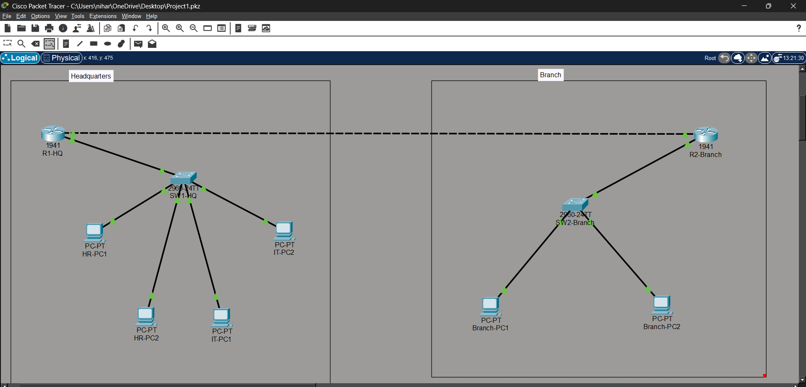
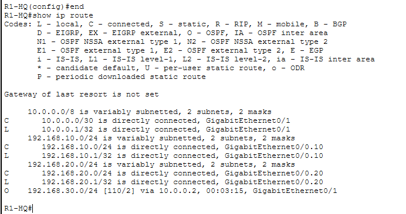
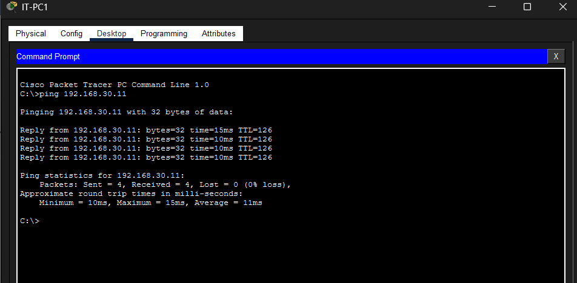
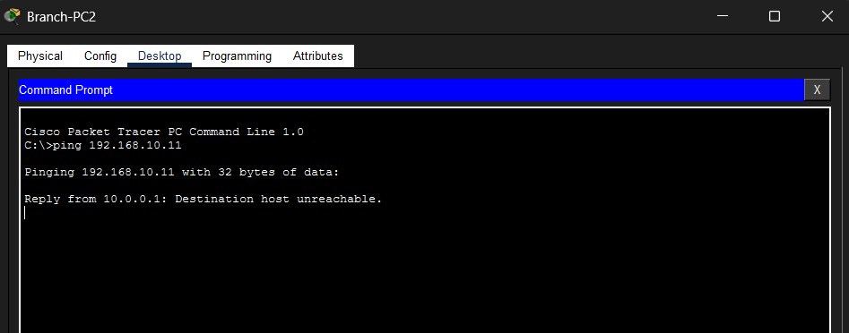

[README.md](https://github.com/user-attachments/files/29791026/README.md)
# Enterprise Network Simulation (Cisco Packet Tracer)

A simulated multi-site enterprise network demonstrating VLAN segmentation, inter-VLAN routing, dynamic routing with OSPF, DHCP automation, and ACL-based security enforcement between a Headquarters site and a Branch office.

## Topology

| Device     | Role                                                      |
|------------|-----------------------------------------------------------|
| R1-HQ      | HQ router — inter-VLAN routing, OSPF, DHCP, ACL           |
| R2-Branch  | Branch router — OSPF, DHCP                                |
| SW1-HQ     | HQ switch — VLAN 10 (HR), VLAN 20 (IT), trunk to R1-HQ    |
| SW2-Branch | Branch switch — VLAN 30 (Branch Users)                    |
## IP Addressing Scheme

| Segment                 | VLAN | Subnet              | Gateway         |
|-------------------------|------|---------------------|-----------------|
| HQ – HR                 | 10   | 192.168.10.0/24     | 192.168.10.1    |
| HQ – IT                 | 20   | 192.168.20.0/24     | 192.168.20.1    |
| Branch – Users          | 30   | 192.168.30.0/24     | 192.168.30.1    |
| R1-HQ <-> R2-Branch WAN | —    | 10.0.0.0/30         | .1 / .2         |

## What This Project Demonstrates

- **VLAN Segmentation (802.1Q)** — isolates HR, IT, and Branch traffic into separate broadcast domains.
- **Router-on-a-Stick** — sub-interfaces on R1-HQ handle inter-VLAN routing for HQ.
- **OSPF (Area 0)** — routers dynamically learn and advertise remote subnets instead of relying on static routes.
- **DHCP** — automated IP assignment per VLAN, removing manual configuration overhead.
- **Extended ACL** — Branch users are explicitly denied access to the HR subnet while retaining access to everything else, enforcing a real segmentation policy rather than just connectivity.

## Verification

**OSPF neighbor adjacency and routing table (R1-HQ):**

**Successful ping — HR PC to Branch PC (proves OSPF end-to-end reachability):**

**Blocked ping — Branch PC to HR PC (proves ACL enforcement):**

## Troubleshooting Process

Verified connectivity and configuration at each stage using:
- `show ip route` — confirmed OSPF-learned routes (marked `O`) populated on both routers
- `show ip ospf neighbor` — confirmed FULL adjacency between R1-HQ and R2-Branch
- `show vlan brief` — confirmed correct VLAN-to-port assignments
- `ping` / `traceroute` — confirmed reachability and validated the ACL was correctly scoped (blocking only HR, not IT)

**Issue found and fixed:** Branch PCs initially failed to reach their default gateway and pull a DHCP lease. Root cause: the switch port uplinking SW2-Branch to R2-Branch was left in the default VLAN 1, while the PC ports were assigned to VLAN 30 — putting the router and the PCs in different broadcast domains. Fixed by explicitly assigning the uplink port to VLAN 30 and re-verifying with `show vlan brief`.

## Files

- `topology.pkt` — full Packet Tracer file, open with Cisco Packet Tracer to inspect/run configs directly
- `docs/` — screenshots referenced above

## Skills Demonstrated

Network segmentation · Inter-VLAN routing · Dynamic routing protocols (OSPF) · DHCP configuration · ACL-based security policy · Network troubleshooting and verification
